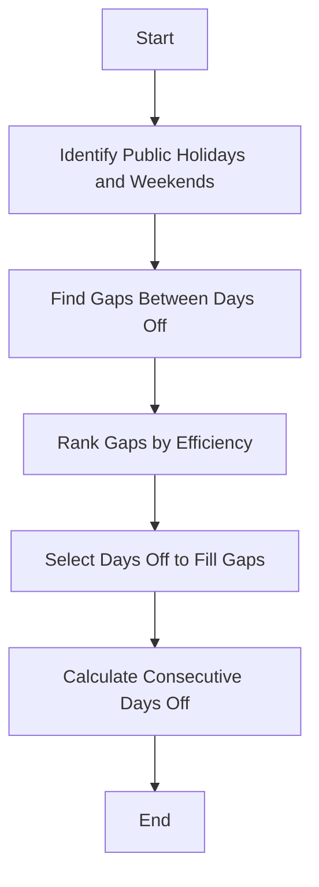

# Stretch My Time Off

Welcome to **Stretch My Time Off**, a personal project designed to help you optimize your vacation days by strategically aligning public holidays and personal leave. This tool allows you to maximize your time off.

## Table of Contents

- [About the Project](#about-the-project)
- [Features](#features)
- [Tech Stack](#tech-stack)
- [Installation](#installation)
- [Usage](#usage)
- [Contributing](#contributing)
- [License](#license)
- [Acknowledgments](#acknowledgments)

## About the Project

I created this project out of a personal need to better manage vacation days. As someone who loves to travel, I wanted a tool that could help me make the most of my time off by aligning it with public holidays. This project was coded using the Cursor IDE with the assistance of GPT-4o, and it is hosted on Vercel with Cloudflare providing additional services.

## Features

- **Country-Specific Holidays**: Automatically fetches public holidays for your country.
- **Optimized Days Off**: Calculates the best way to use your personal leave days to maximize time off.
- **Interactive Calendar**: Visualize your holidays and optimized days off in a user-friendly calendar.
- **Responsive Design**: Works seamlessly on both desktop and mobile devices.

## Tech Stack

- **Framework**: [SvelteKit](https://kit.svelte.dev/)
- **Programming Language**: JavaScript
- **Styling**: CSS
- **Hosting**: [Vercel](https://vercel.com/)
- **CDN and Security**: [Cloudflare](https://www.cloudflare.com/)
- **IDE**: [Cursor IDE](https://cursor.so/)

## Installation

To get a local copy up and running, follow these steps:

1. **Clone the repository**:
   ```bash
   git clone https://github.com/yourusername/stretch-my-time-off.git
   ```

2. **Navigate to the project directory**:
   ```bash
   cd stretch-my-time-off
   ```

3. **Install dependencies**:
   ```bash
   npm install
   ```

4. **Start the development server**:
   ```bash
   npm run dev
   ```

## Usage

Once the development server is running, you can access the application at `http://localhost:3000`. Enter your country to see the public holidays and use the interactive calendar to plan your time off.


## Algorithm

The core of this project is an algorithm that optimizes your personal leave days to create the longest possible chains of consecutive days off. Here's a simplified explanation:

1. **Identify Public Holidays and Weekends**: The algorithm first identifies all public holidays and weekends for the selected year and country.

2. **Find Gaps**: It then finds gaps between these days off that can be filled with personal leave days.

3. **Rank Gaps**: The gaps are ranked based on their efficiency in creating longer chains of days off.

4. **Select Days Off**: The algorithm selects the most efficient gaps to fill with your available personal leave days.

5. **Calculate Consecutive Days Off**: Finally, it calculates the total number of consecutive days off you can achieve.

Here's a visual representation of the algorithm using a Mermaid diagram:



## Contributing

Contributions are welcome! If you have suggestions for improvements or new features, feel free to open an issue or submit a pull request.

1. Fork the Project
2. Create your Feature Branch (`git checkout -b feature/AmazingFeature`)
3. Commit your Changes (`git commit -m 'Add some AmazingFeature'`)
4. Push to the Branch (`git push origin feature/AmazingFeature`)
5. Open a Pull Request

## License

Distributed under the MIT License. See `LICENSE` for more information.

## Acknowledgments

- **SvelteKit**: For providing a powerful and flexible framework.
- **Vercel**: For seamless deployment and hosting.
- **Cloudflare**: For robust CDN and security features.
- **Cursor IDE and GPT-4o**: For making the development process efficient and enjoyable.
