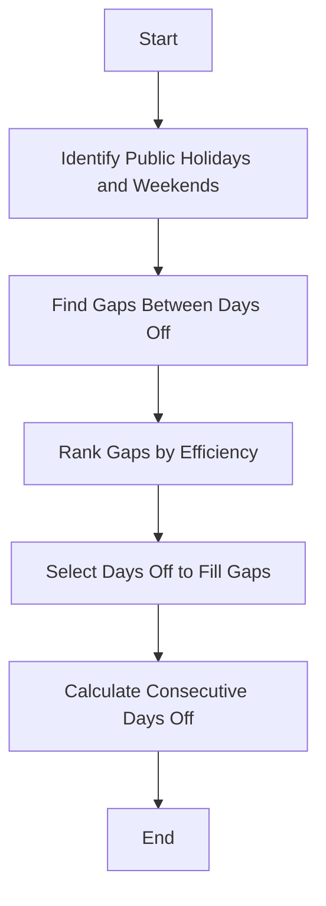

# Stretch My Time Off

**Stretch My Time Off** is a tool designed to help you optimize your vacation days by aligning public holidays and personal leave. This project was generated entirely with ChatGPT in a code editor designed for AI-assisted development.

Website: https://stretchmytimeoff.com


## Table of Contents

- [About the Project](#about-the-project)
- [Features](#features)
- [Tech Stack](#tech-stack)
- [Installation](#installation)
- [Usage](#usage)
- [Algorithm](#algorithm)
- [Contributing](#contributing)
- [License](#license)
- [Acknowledgments](#acknowledgments)

## About the Project

This project was created to efficiently manage vacation days by aligning them with public holidays. It was developed using the Cursor IDE with GPT-4o and is hosted on Vercel with Cloudflare.

## Features

- **Country-Specific Holidays**: Fetches public holidays for your country.
- **Optimized Days Off**: Calculates the best use of personal leave days.
- **Interactive Calendar**: Visualizes holidays and optimized days off.
- **Responsive Design**: Compatible with desktop and mobile devices.

## Tech Stack

- **Framework**: [SvelteKit](https://kit.svelte.dev/)
- **Programming Language**: JavaScript
- **Styling**: CSS
- **Hosting**: [Vercel](https://vercel.com/)
- **CDN and Security**: [Cloudflare](https://www.cloudflare.com/)
- **IDE**: [Cursor IDE](https://cursor.so/)

## Installation

1. **Clone the repository**:
   ```bash
   git clone https://github.com/yourusername/stretch-my-time-off.git
   ```

2. **Navigate to the project directory**:
   ```bash
   cd stretch-my-time-off
   ```

3. **Install dependencies**:
   ```bash
   npm install
   ```

4. **Start the development server**:
   ```bash
   npm run dev
   ```

## Usage

Access the application at `http://localhost:3000`. Enter your country to view public holidays and plan your time off using the interactive calendar.

## Algorithm

The algorithm optimizes personal leave days to maximize consecutive days off:

1. **Identify Public Holidays and Weekends**.
2. **Find Gaps** between these days.
3. **Rank Gaps** by efficiency.
4. **Select Days Off** to fill gaps.
5. **Calculate Consecutive Days Off**.



## Contributing

Contributions are welcome! Open an issue or submit a pull request for improvements or new features.

## License

Distributed under the MIT License. See `LICENSE` for more information.

## Acknowledgments

- **SvelteKit**: For the framework.
- **Vercel**: For hosting.
- **Cloudflare**: For CDN and security.
- **Cursor IDE and GPT-4o**: For development assistance.

---

**Disclaimer**: This project was 100% generated with ChatGPT out of pure interest, using a code editor designed for AI-assisted development.
